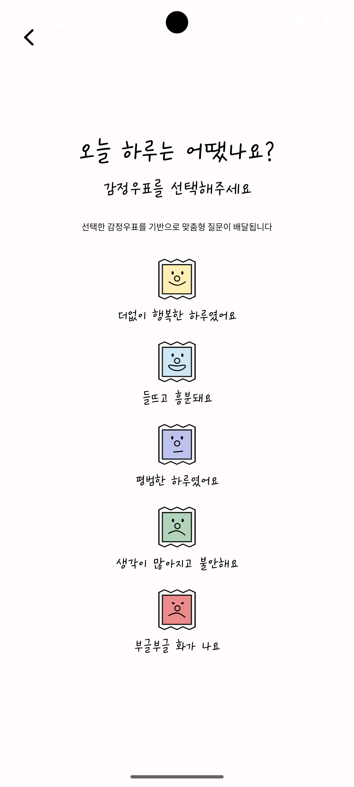
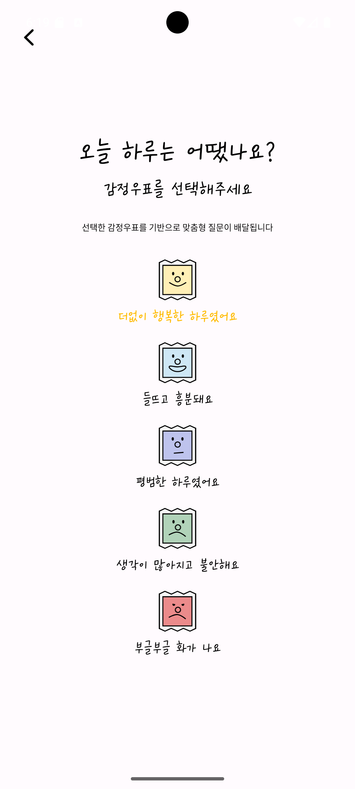
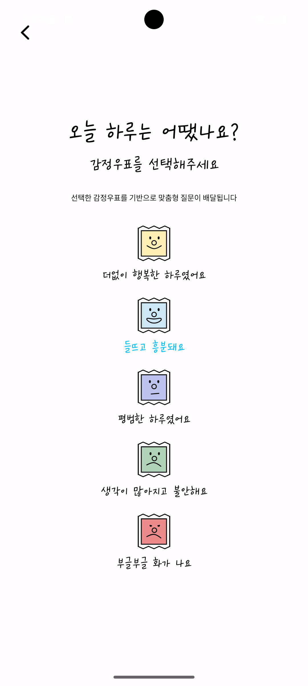
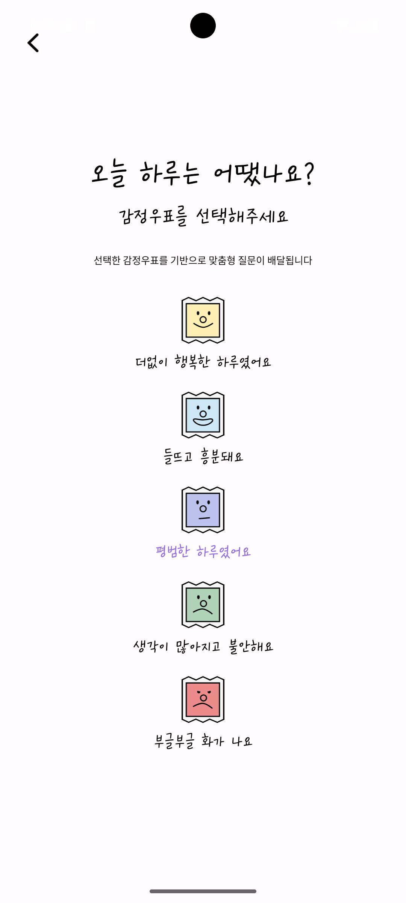
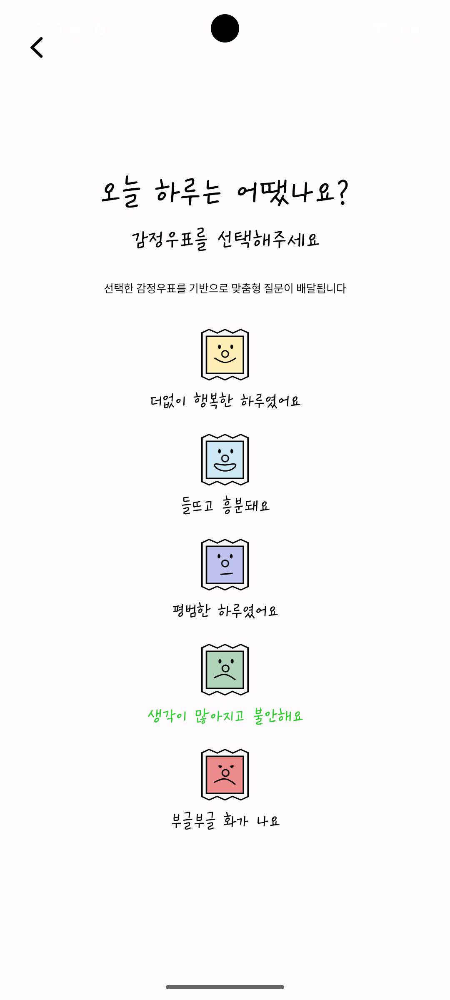
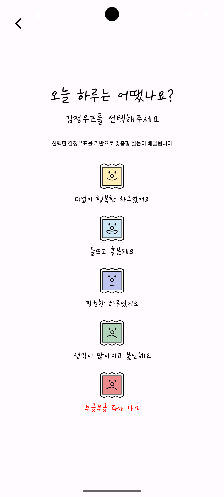

# 📬 1주차 실전 미션 제출

## 📋 구현 사항
- 감정 우표 단일 화면 UI 구현
- 감정 우표 아이콘 클릭 시 해당 아이콘 하단 텍스트만 색상이 변경되도록 구현
- 선택된 감정만 강조되도록 처리하고 다른 텍스트는 기본 색상 유지

---

## ✅ 미션 체크리스트

- [x] **Figma에 있는 단일 화면 구성해보기**
    - 피그마 디자인 가이드를 바탕으로 UI 레이아웃 구현 완료

- [x] **고정 dp, layout_constraint 등을 이용해 위젯 중앙 정렬 및 화면 구현**
    - ConstraintLayout을 활용하여 다양한 해상도에서도 중앙 정렬이 유지되도록 구현

- [x] **각 방법에 대해 정리해보기**
    - ConstraintLayout 기반 UI 배치 방식과 레이아웃 구조 정리

- [x] **감정 우표 이미지 클릭 시 효과 적용**
    - 클릭한 감정 우표에 대응하는 텍스트만 색상이 변경되도록 처리

---

## 📸 스크린샷

