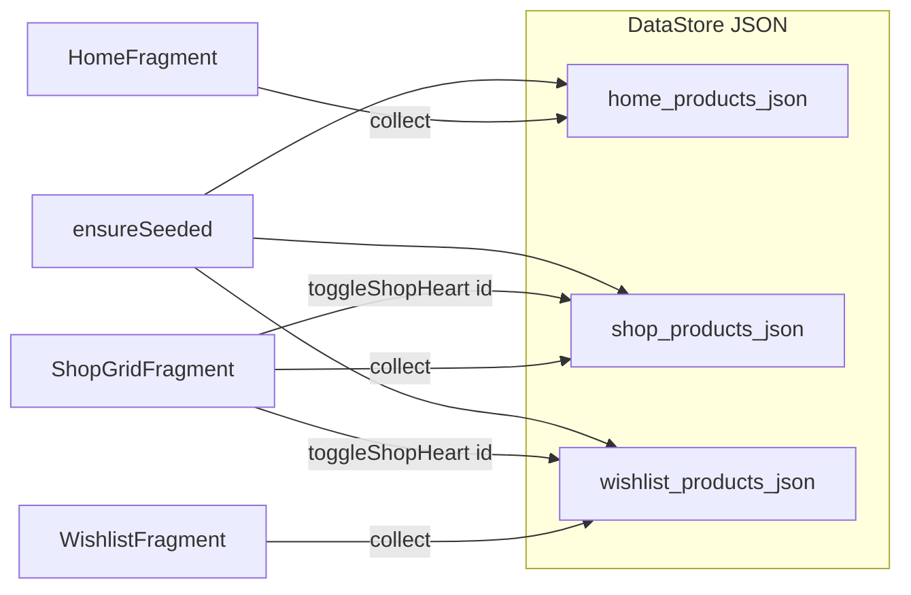

# Week04 Nike 앱 - DataStore·Gson·구매하기 탭 구조 코드 설명 가이드

Week03까지는 **RecyclerView + 더미 데이터**로 화면만 구성했습니다. Week04에서는 **Preferences DataStore**에 상품 목록을 **JSON(Gson)** 으로 저장·불러오고, **구매하기 하트**와 **위시리스트**를 **같은 저장소**로 맞춰 앱을 껐다 켜도 유지되게 했습니다. 또 **구매하기** 탭 중 `전체`만 상품 그리드를 보여 주고, `Tops & T-Shirts` / `sale`는 **빈 placeholder Fragment**만 두었습니다(이후 주차 확장용).

> **프로젝트 경로:** 저장소 기준 **`Week04/LinLin/`** — 아래 Kotlin/XML 경로는 모듈 루트 **`app/`** 기준입니다.  
> 이 문서는 **로컬에서 복습용**으로 두었습니다. Git에 올리지 않아도 되고, `.gitignore`도 수정하지 않았습니다.

---

## Week04에서 바뀐 점 한눈에

| 구분 | 내용 |
|------|------|
| 저장소 | `DataStore<Preferences>` + 문자열 키 3개에 JSON 배열 저장 |
| 직렬화 | Gson + `TypeToken<List<ProductItem>>` 로 리스트 역직렬화 |
| 화면 | 홈 / 구매 그리드 / 위시 → 각각 `Flow` 구독으로 목록 갱신 |
| 하트 | `toggleShopHeart(id)` 가 SHOP JSON과 WISHLIST JSON을 한 번에 수정 |
| 구매하기 UI | `ShopFragment`가 **자식 Fragment**로 `ShopGridFragment` 또는 placeholder 교체 |

---

## Gradle 의존성

`app/build.gradle.kts`

```kotlin
plugins {
    alias(libs.plugins.android.application)
}

android {
    namespace = "com.example.week02"
    compileSdk = 36

    defaultConfig {
        applicationId = "com.example.week02"
        minSdk = 24
        targetSdk = 36
        versionCode = 1
        versionName = "1.0"

        testInstrumentationRunner = "androidx.test.runner.AndroidJUnitRunner"
    }

    buildFeatures {
        viewBinding = true
        dataBinding = true
    }

    buildTypes {
        release {
            isMinifyEnabled = false
            proguardFiles(
                getDefaultProguardFile("proguard-android-optimize.txt"),
                "proguard-rules.pro"
            )
        }
    }

    compileOptions {
        sourceCompatibility = JavaVersion.VERSION_11
        targetCompatibility = JavaVersion.VERSION_11
    }
}

dependencies {
    implementation(libs.androidx.core.ktx)
    implementation(libs.androidx.appcompat)
    implementation(libs.material)
    implementation(libs.androidx.activity)
    implementation(libs.androidx.constraintlayout)
    implementation("androidx.fragment:fragment-ktx:1.8.5")
    implementation("androidx.recyclerview:recyclerview:1.3.2")
    implementation("androidx.cardview:cardview:1.0.0")
    implementation("androidx.datastore:datastore-preferences:1.1.1")
    implementation("com.google.code.gson:gson:2.10.1")
    implementation("androidx.lifecycle:lifecycle-runtime-ktx:2.8.7")

    testImplementation(libs.junit)
    androidTestImplementation(libs.androidx.junit)
    androidTestImplementation(libs.androidx.espresso.core)
}
```

- **datastore-preferences:** 키–값 저장(API는 `Preferences` + `edit`).
- **gson:** `ProductItem` 리스트 ↔ JSON 문자열.
- **lifecycle-runtime-ktx:** Fragment의 `lifecycleScope` + `launch`로 `Flow.collect` / `suspend` 호출.

---

## ProductPreferencesRepository.kt

`app/src/main/java/com/example/week02/data/ProductPreferencesRepository.kt`

```kotlin
package com.example.week02.data

import android.content.Context
import androidx.datastore.core.DataStore
import androidx.datastore.preferences.core.Preferences
import androidx.datastore.preferences.core.edit
import androidx.datastore.preferences.core.stringPreferencesKey
import androidx.datastore.preferences.preferencesDataStore
import com.google.gson.Gson
import com.google.gson.reflect.TypeToken
import kotlinx.coroutines.flow.Flow
import kotlinx.coroutines.flow.map

private val Context.productPreferencesDataStore: DataStore<Preferences> by preferencesDataStore(
    name = "nike_product_prefs",
)

private val KEY_HOME = stringPreferencesKey("home_products_json")
private val KEY_SHOP = stringPreferencesKey("shop_products_json")
private val KEY_WISHLIST = stringPreferencesKey("wishlist_products_json")

class ProductPreferencesRepository(context: Context) {

    private val appContext = context.applicationContext
    private val gson = Gson()
    private val listType = object : TypeToken<List<ProductItem>>() {}.type

    private fun parseList(json: String?): List<ProductItem> {
        if (json.isNullOrBlank()) return emptyList()
        return gson.fromJson(json, listType) ?: emptyList()
    }

    fun homeProductsFlow(): Flow<List<ProductItem>> =
        appContext.productPreferencesDataStore.data.map { prefs -> parseList(prefs[KEY_HOME]) }

    fun shopProductsFlow(): Flow<List<ProductItem>> =
        appContext.productPreferencesDataStore.data.map { prefs -> parseList(prefs[KEY_SHOP]) }

    fun wishlistProductsFlow(): Flow<List<ProductItem>> =
        appContext.productPreferencesDataStore.data.map { prefs -> parseList(prefs[KEY_WISHLIST]) }

    /** 최초 실행 시 ProductDummyData 기준으로 JSON 시드 */
    suspend fun ensureSeeded() {
        appContext.productPreferencesDataStore.edit { prefs ->
            if (prefs[KEY_HOME] == null) {
                prefs[KEY_HOME] = gson.toJson(ProductDummyData.homeNewProducts())
            }
            if (prefs[KEY_SHOP] == null) {
                prefs[KEY_SHOP] = gson.toJson(ProductDummyData.shopProducts())
            }
            if (prefs[KEY_WISHLIST] == null) {
                val shop = parseList(prefs[KEY_SHOP])
                val wish = shop.filter { it.heartFilled }.map { it.forWishlistRow() }
                prefs[KEY_WISHLIST] = gson.toJson(wish)
            }
        }
    }

    /** 구매하기 하트 토글 + 위시리스트 동기화 (DataStore에 저장) */
    suspend fun toggleShopHeart(productId: Int) {
        appContext.productPreferencesDataStore.edit { prefs ->
            val shop = parseList(prefs[KEY_SHOP]).toMutableList()
            val idx = shop.indexOfFirst { it.id == productId }
            if (idx < 0) return@edit
            val old = shop[idx]
            val newHeart = !old.heartFilled
            shop[idx] = old.copy(heartFilled = newHeart)
            val wish = parseList(prefs[KEY_WISHLIST]).toMutableList()
            if (newHeart) {
                if (wish.none { it.id == productId }) {
                    wish.add(old.copy(heartFilled = true, showHeart = false))
                }
            } else {
                wish.removeAll { it.id == productId }
            }
            prefs[KEY_SHOP] = gson.toJson(shop)
            prefs[KEY_WISHLIST] = gson.toJson(wish)
        }
    }

    private fun ProductItem.forWishlistRow(): ProductItem =
        copy(showHeart = false, heartFilled = false)
}
```

### 설명

1. **`preferencesDataStore(name = …)`**  
   `Context` 확장으로 `DataStore` 인스턴스를 한 번만 만들고 재사용합니다. 파일 이름은 `nike_product_prefs`에 대응합니다.

2. **키 3개**  
   홈 / 구매하기 / 위시리스트 각각 JSON 문자열 하나씩 저장합니다.

3. **`Flow`**  
   `data.map { … }` 로 저장소가 바뀔 때마다 파싱된 `List<ProductItem>` 이 흘러나가므로, Fragment에서 `collect`만 하면 UI를 맞출 수 있습니다.

4. **`ensureSeeded()`**  
   해당 키가 **아직 없을 때만** `ProductDummyData`로 채웁니다. 위시리스트는 **이미 쓴 SHOP JSON**을 읽어서 `heartFilled == true`인 상품만 넣어, 더미의 id 불일치 문제를 피합니다.

5. **`toggleShopHeart(productId)`**  
   구매하기 목록에서 해당 `id`의 `heartFilled`를 뒤집고, 켜지면 위시에 **같은 id**로 추가, 꺼지면 위시에서 제거합니다. 위시 쪽 행은 하트 UI를 쓰지 않도록 `showHeart = false`로 넣습니다.

6. **`TypeToken<List<ProductItem>>`**  
   Gson이 제네릭 리스트 타입을 알 수 있게 해서 `fromJson`이 리스트로 나옵니다.

---

## ProductItem.kt / ProductDummyData.kt (참고)

Week04에서도 **모델과 초기 더미 값의 “원본”**은 그대로입니다. 실제 런타임 목록은 DataStore JSON이 우선입니다.

- `ProductItem` — `id`, `imageResId`, `name`, `price`, `showHeart`, `heartFilled` 등.
- `ProductDummyData.homeNewProducts()` / `shopProducts()` — `ensureSeeded()`가 최초 1회만 이걸 JSON으로 넣습니다.

경로:

- `app/src/main/java/com/example/week02/data/ProductItem.kt`
- `app/src/main/java/com/example/week02/data/ProductDummyData.kt`

---

## HomeFragment.kt

`app/src/main/java/com/example/week02/ui/home/HomeFragment.kt`

```kotlin
package com.example.week02.ui.home

import android.os.Bundle
import android.view.LayoutInflater
import android.view.View
import android.view.ViewGroup
import androidx.fragment.app.Fragment
import androidx.lifecycle.lifecycleScope
import androidx.recyclerview.widget.LinearLayoutManager
import com.example.week02.data.ProductItem
import com.example.week02.data.ProductPreferencesRepository
import com.example.week02.databinding.FragmentHomeBinding
import kotlinx.coroutines.launch
import java.text.SimpleDateFormat
import java.util.Calendar
import java.util.Locale

class HomeFragment : Fragment() {
    private var _binding: FragmentHomeBinding? = null
    private val binding get() = _binding!!

    private val homeItems = mutableListOf<ProductItem>()
    private var homeAdapter: HomeNewProductAdapter? = null

    override fun onCreateView(
        inflater: LayoutInflater,
        container: ViewGroup?,
        savedInstanceState: Bundle?
    ): View {
        _binding = FragmentHomeBinding.inflate(inflater, container, false)
        return binding.root
    }

    override fun onViewCreated(view: View, savedInstanceState: Bundle?) {
        super.onViewCreated(view, savedInstanceState)
        binding.tvDate.text = formatKoreanDateLine()
        binding.rvNewProducts.layoutManager =
            LinearLayoutManager(requireContext(), LinearLayoutManager.HORIZONTAL, false)
        homeAdapter = HomeNewProductAdapter(homeItems)
        binding.rvNewProducts.adapter = homeAdapter
        val repo = ProductPreferencesRepository(requireContext())
        viewLifecycleOwner.lifecycleScope.launch {
            repo.ensureSeeded()
            repo.homeProductsFlow().collect { list ->
                homeItems.clear()
                homeItems.addAll(list)
                homeAdapter?.notifyDataSetChanged()
            }
        }
    }

    override fun onDestroyView() {
        super.onDestroyView()
        _binding = null
    }

    private fun formatKoreanDateLine(): String {
        val cal = Calendar.getInstance()
        val month = cal.get(Calendar.MONTH) + 1
        val day = cal.get(Calendar.DAY_OF_MONTH)
        val weekday = SimpleDateFormat("EEEE", Locale.KOREAN).format(cal.time)
        return "${month}월 ${day}일 $weekday"
    }
}
```

- `HomeNewProductAdapter`는 **같은 `MutableList` 참조**를 들고 있으므로, `clear` + `addAll` 후 `notifyDataSetChanged()`로 가로 목록이 DataStore와 동기화됩니다.

---

## WishlistFragment.kt

`app/src/main/java/com/example/week02/ui/wishlist/WishlistFragment.kt`

```kotlin
package com.example.week02.ui.wishlist

import android.os.Bundle
import android.view.LayoutInflater
import android.view.View
import android.view.ViewGroup
import androidx.fragment.app.Fragment
import androidx.lifecycle.lifecycleScope
import androidx.recyclerview.widget.GridLayoutManager
import com.example.week02.data.ProductItem
import com.example.week02.data.ProductPreferencesRepository
import com.example.week02.databinding.FragmentWishlistBinding
import kotlinx.coroutines.launch
import com.example.week02.ui.shop.ShopProductAdapter

class WishlistFragment : Fragment() {
    private var _binding: FragmentWishlistBinding? = null
    private val binding get() = _binding!!

    private val wishlistItems = mutableListOf<ProductItem>()
    private val wishlistAdapter by lazy { ShopProductAdapter(wishlistItems) }

    override fun onCreateView(
        inflater: LayoutInflater,
        container: ViewGroup?,
        savedInstanceState: Bundle?
    ): View {
        _binding = FragmentWishlistBinding.inflate(inflater, container, false)
        return binding.root
    }

    override fun onViewCreated(view: View, savedInstanceState: Bundle?) {
        super.onViewCreated(view, savedInstanceState)
        binding.rvWishlist.layoutManager = GridLayoutManager(requireContext(), 2)
        binding.rvWishlist.adapter = wishlistAdapter
        val repo = ProductPreferencesRepository(requireContext())
        viewLifecycleOwner.lifecycleScope.launch {
            repo.ensureSeeded()
            repo.wishlistProductsFlow().collect { list ->
                wishlistItems.clear()
                wishlistItems.addAll(list)
                wishlistAdapter.notifyDataSetChanged()
            }
        }
    }

    override fun onDestroyView() {
        super.onDestroyView()
        _binding = null
    }
}
```

- `ShopProductAdapter`에 **하트 콜백을 넘기지 않음** → 위시 화면에서는 어댑터 내부 분기로 하트가 안 보이거나( `showHeart == false` ) 기본 동작만 해당합니다.

---

## ShopFragment.kt

`app/src/main/java/com/example/week02/ui/shop/ShopFragment.kt`

```kotlin
package com.example.week02.ui.shop

import android.os.Bundle
import android.view.LayoutInflater
import android.view.View
import android.view.ViewGroup
import androidx.fragment.app.Fragment
import com.example.week02.R
import com.example.week02.databinding.FragmentShopBinding
import com.google.android.material.tabs.TabLayout

class ShopFragment : Fragment() {
    private var _binding: FragmentShopBinding? = null
    private val binding get() = _binding!!

    override fun onCreateView(
        inflater: LayoutInflater,
        container: ViewGroup?,
        savedInstanceState: Bundle?,
    ): View {
        _binding = FragmentShopBinding.inflate(inflater, container, false)
        return binding.root
    }

    override fun onViewCreated(view: View, savedInstanceState: Bundle?) {
        super.onViewCreated(view, savedInstanceState)
        binding.tabLayout.addTab(binding.tabLayout.newTab().setText("전체"))
        binding.tabLayout.addTab(binding.tabLayout.newTab().setText("Tops & T-Shirts"))
        binding.tabLayout.addTab(binding.tabLayout.newTab().setText("sale"))

        binding.tabLayout.addOnTabSelectedListener(object : TabLayout.OnTabSelectedListener {
            override fun onTabSelected(tab: TabLayout.Tab) {
                showTabContent(tab.position)
            }

            override fun onTabUnselected(tab: TabLayout.Tab) = Unit
            override fun onTabReselected(tab: TabLayout.Tab) = Unit
        })

        if (savedInstanceState == null) {
            showTabContent(0)
        }
    }

    private fun showTabContent(position: Int) {
        val fragment = when (position) {
            0 -> ShopGridFragment()
            1 -> ShopTabPlaceholderFragment.newInstance("")
            2 -> ShopTabPlaceholderFragment.newInstance("")
            else -> ShopGridFragment()
        }
        childFragmentManager.beginTransaction()
            .setReorderingAllowed(true)
            .replace(R.id.shop_tab_container, fragment)
            .commit()
    }

    override fun onDestroyView() {
        super.onDestroyView()
        _binding = null
    }
}
```

- **`childFragmentManager`** 로 `shop_tab_container` 안만 갈아 끼웁니다. 메인 액티비티의 `ShopFragment`는 그대로입니다.
- **`savedInstanceState == null`일 때만** `showTabContent(0)` — 화면 회전 시에는 시스템이 자식 Fragment 상태를 복구합니다.
- 탭 1·2는 **빈 문자열** placeholder(완전 빈 화면에 가깝게). 나중에 문구 넣으려면 `newInstance("…")`만 바꾸면 됩니다.

---

## ShopGridFragment.kt

`app/src/main/java/com/example/week02/ui/shop/ShopGridFragment.kt`

```kotlin
package com.example.week02.ui.shop

import android.os.Bundle
import android.view.LayoutInflater
import android.view.View
import android.view.ViewGroup
import androidx.fragment.app.Fragment
import androidx.lifecycle.lifecycleScope
import androidx.recyclerview.widget.GridLayoutManager
import com.example.week02.data.ProductItem
import com.example.week02.data.ProductPreferencesRepository
import com.example.week02.databinding.FragmentShopGridBinding
import kotlinx.coroutines.Dispatchers
import kotlinx.coroutines.launch
import kotlinx.coroutines.withContext

class ShopGridFragment : Fragment() {
    private var _binding: FragmentShopGridBinding? = null
    private val binding get() = _binding!!

    private val items = mutableListOf<ProductItem>()
    private lateinit var repo: ProductPreferencesRepository

    private val gridAdapter: ShopProductAdapter by lazy {
        ShopProductAdapter(items) { position ->
            val id = items.getOrNull(position)?.id ?: return@ShopProductAdapter
            viewLifecycleOwner.lifecycleScope.launch {
                withContext(Dispatchers.IO) { repo.toggleShopHeart(id) }
            }
        }
    }

    override fun onCreateView(
        inflater: LayoutInflater,
        container: ViewGroup?,
        savedInstanceState: Bundle?,
    ): View {
        _binding = FragmentShopGridBinding.inflate(inflater, container, false)
        return binding.root
    }

    override fun onViewCreated(view: View, savedInstanceState: Bundle?) {
        super.onViewCreated(view, savedInstanceState)
        repo = ProductPreferencesRepository(requireContext())
        binding.rvProducts.layoutManager = GridLayoutManager(requireContext(), 2)
        binding.rvProducts.adapter = gridAdapter
        viewLifecycleOwner.lifecycleScope.launch {
            repo.ensureSeeded()
            repo.shopProductsFlow().collect { list ->
                items.clear()
                items.addAll(list)
                gridAdapter.notifyDataSetChanged()
            }
        }
    }

    override fun onDestroyView() {
        super.onDestroyView()
        _binding = null
    }
}
```

- 하트 클릭 시 **리스트를 직접 토글하지 않고** `toggleShopHeart`만 호출합니다. 저장이 끝나면 `Flow`가 새 목록을 보내 어댑터가 다시 그립니다.
- `toggleShopHeart`는 **IO 디스패처**에서 실행해 DataStore I/O가 메인 스레드를 막지 않게 했습니다.

---

## ShopTabPlaceholderFragment.kt

`app/src/main/java/com/example/week02/ui/shop/ShopTabPlaceholderFragment.kt`

```kotlin
package com.example.week02.ui.shop

import android.os.Bundle
import android.view.LayoutInflater
import android.view.View
import android.view.ViewGroup
import androidx.core.os.bundleOf
import androidx.fragment.app.Fragment
import com.example.week02.databinding.FragmentShopTabPlaceholderBinding

class ShopTabPlaceholderFragment : Fragment() {
    private var _binding: FragmentShopTabPlaceholderBinding? = null
    private val binding get() = _binding!!

    override fun onCreateView(
        inflater: LayoutInflater,
        container: ViewGroup?,
        savedInstanceState: Bundle?,
    ): View {
        _binding = FragmentShopTabPlaceholderBinding.inflate(inflater, container, false)
        return binding.root
    }

    override fun onViewCreated(view: View, savedInstanceState: Bundle?) {
        super.onViewCreated(view, savedInstanceState)
        binding.tvPlaceholder.text = arguments?.getString(ARG_MESSAGE).orEmpty()
    }

    override fun onDestroyView() {
        super.onDestroyView()
        _binding = null
    }

    companion object {
        private const val ARG_MESSAGE = "message"

        fun newInstance(message: String): ShopTabPlaceholderFragment =
            ShopTabPlaceholderFragment().apply {
                arguments = bundleOf(ARG_MESSAGE to message)
            }
    }
}
```

---

## ShopProductAdapter.kt

`app/src/main/java/com/example/week02/ui/shop/ShopProductAdapter.kt`

```kotlin
package com.example.week02.ui.shop

import android.view.LayoutInflater
import android.view.View
import android.view.ViewGroup
import androidx.recyclerview.widget.RecyclerView
import com.example.week02.R
import com.example.week02.data.ProductItem
import com.example.week02.databinding.ItemShopProductBinding

class ShopProductAdapter(
    private val items: MutableList<ProductItem>,
    private val onHeartClick: ((position: Int) -> Unit)? = null,
) : RecyclerView.Adapter<ShopProductAdapter.VH>() {

    class VH(val binding: ItemShopProductBinding) : RecyclerView.ViewHolder(binding.root)

    override fun onCreateViewHolder(parent: ViewGroup, viewType: Int): VH {
        val binding = ItemShopProductBinding.inflate(
            LayoutInflater.from(parent.context),
            parent,
            false,
        )
        return VH(binding)
    }

    override fun onBindViewHolder(holder: VH, position: Int) {
        val item = items[position]
        val b = holder.binding
        b.ivProduct.setImageResource(item.imageResId)
        b.tvName.text = item.name
        if (item.subtitle != null) {
            b.tvSubtitle.visibility = View.VISIBLE
            b.tvSubtitle.text = item.subtitle
        } else {
            b.tvSubtitle.visibility = View.GONE
        }
        if (item.colorsLabel != null) {
            b.tvColors.visibility = View.VISIBLE
            b.tvColors.text = item.colorsLabel
        } else {
            b.tvColors.visibility = View.GONE
        }
        b.tvPrice.text = item.price
        b.tvBestSeller.visibility = if (item.isBestSeller) View.VISIBLE else View.GONE
        if (item.showHeart) {
            b.ivHeart.visibility = View.VISIBLE
            b.ivHeart.setImageResource(
                if (item.heartFilled) R.drawable.ic_heart_filled else R.drawable.ic_heart_outline,
            )
            b.ivHeart.setOnClickListener {
                val pos = holder.bindingAdapterPosition
                if (pos == RecyclerView.NO_POSITION) return@setOnClickListener
                if (onHeartClick != null) {
                    onHeartClick.invoke(pos)
                } else {
                    val current = items[pos]
                    items[pos] = current.copy(heartFilled = !current.heartFilled)
                    notifyItemChanged(pos)
                }
            }
        } else {
            b.ivHeart.visibility = View.GONE
            b.ivHeart.setOnClickListener(null)
        }
    }

    override fun getItemCount() = items.size
}
```

- **구매하기(`ShopGridFragment`)**는 `onHeartClick`을 넘깁니다 → **저장소만** 갱신.
- **위시리스트**는 콜백 없음 + 항목은 `showHeart == false` 위주 → 하트는 숨김.

---

## 레이아웃 XML

### fragment_shop.xml

`app/src/main/res/layout/fragment_shop.xml`

```xml
<?xml version="1.0" encoding="utf-8"?>
<androidx.constraintlayout.widget.ConstraintLayout xmlns:android="http://schemas.android.com/apk/res/android"
    xmlns:app="http://schemas.android.com/apk/res-auto"
    xmlns:tools="http://schemas.android.com/tools"
    android:layout_width="match_parent"
    android:layout_height="match_parent"
    android:background="@color/white">

    <TextView
        android:id="@+id/tv_shop_title"
        android:layout_width="wrap_content"
        android:layout_height="wrap_content"
        android:layout_marginTop="16dp"
        android:text="구매하기"
        android:textColor="@color/black"
        android:textSize="18sp"
        android:textStyle="bold"
        app:layout_constraintEnd_toEndOf="parent"
        app:layout_constraintStart_toStartOf="parent"
        app:layout_constraintTop_toTopOf="parent" />

    <com.google.android.material.tabs.TabLayout
        android:id="@+id/tab_layout"
        android:layout_width="0dp"
        android:layout_height="wrap_content"
        android:layout_marginTop="8dp"
        android:background="@color/white"
        app:tabMode="scrollable"
        app:tabBackground="@drawable/bg_tab_transparent"
        app:tabIndicatorColor="@color/black"
        app:tabSelectedTextColor="@color/black"
        app:tabTextColor="@color/nav_unselected"
        app:layout_constraintEnd_toEndOf="parent"
        app:layout_constraintStart_toStartOf="parent"
        app:layout_constraintTop_toBottomOf="@id/tv_shop_title" />

    <androidx.fragment.app.FragmentContainerView
        android:id="@+id/shop_tab_container"
        android:layout_width="0dp"
        android:layout_height="0dp"
        app:layout_constraintBottom_toBottomOf="parent"
        app:layout_constraintEnd_toEndOf="parent"
        app:layout_constraintStart_toStartOf="parent"
        app:layout_constraintTop_toBottomOf="@id/tab_layout" />
</androidx.constraintlayout.widget.ConstraintLayout>
```

- 이전의 탭 아래 **단일 `RecyclerView`** 대신 **`FragmentContainerView`**만 두고, 그 안에 자식 Fragment를 넣습니다.
- **`android:name`은 붙이지 않음** — XML이 자동으로 그리드 Fragment를 만들면 `replace`와 중복될 수 있어서, 첫 표시는 코드의 `showTabContent(0)`에만 맡깁니다.

### fragment_shop_grid.xml

`app/src/main/res/layout/fragment_shop_grid.xml`

```xml
<?xml version="1.0" encoding="utf-8"?>
<androidx.recyclerview.widget.RecyclerView xmlns:android="http://schemas.android.com/apk/res/android"
    xmlns:tools="http://schemas.android.com/tools"
    android:id="@+id/rv_products"
    android:layout_width="match_parent"
    android:layout_height="match_parent"
    android:background="@color/white"
    android:clipToPadding="false"
    android:paddingHorizontal="10dp"
    android:paddingTop="8dp"
    android:paddingBottom="16dp"
    tools:listitem="@layout/item_shop_product" />
```

### fragment_shop_tab_placeholder.xml

`app/src/main/res/layout/fragment_shop_tab_placeholder.xml`

```xml
<?xml version="1.0" encoding="utf-8"?>
<FrameLayout xmlns:android="http://schemas.android.com/apk/res/android"
    android:layout_width="match_parent"
    android:layout_height="match_parent"
    android:background="@color/white">

    <TextView
        android:id="@+id/tv_placeholder"
        android:layout_width="wrap_content"
        android:layout_height="wrap_content"
        android:layout_gravity="center"
        android:gravity="center"
        android:padding="24dp"
        android:textColor="@color/text_secondary"
        android:textSize="15sp" />
</FrameLayout>
```

---

## 데이터 흐름 (요약)



---

## Android Studio에서 실행이 안 될 때 (참고)

- **실행할 모듈의 루트**가 `Week04/LinLin`인지 확인하세요. 상위 폴더 `UMC_Week01`만 열고 하위 `Week01`만 Gradle 프로젝트인 경우, **File → Open**으로 `Week04/LinLin`을 열면 `app` 실행 구성이 맞습니다.
- 에뮬레이터는 켜져 있어도 **Run(▶)** 을 눌러야 앱이 설치·실행됩니다.
- `local.properties`에 `sdk.dir`이 있어야 Gradle이 빌드됩니다(Android Studio가 보통 자동 생성).

---

## Week02~03 전체 흐름이 더 필요하면

같은 형식의 긴 가이드는 저장소의 **`Week02/LinLin/코드_설명_가이드.md`** (Week02~Week03 기준)를 참고하면 됩니다. Week04는 위 파일들이 **저장소·탭 구조** 중심으로 추가·변경된 버전입니다.
